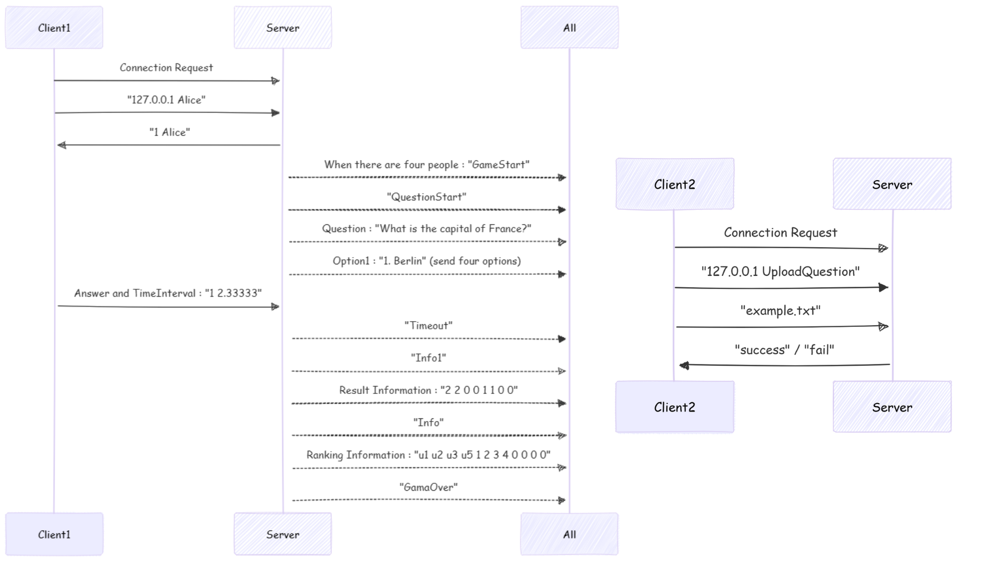

# Network Programming Final Project - Kahoot

## Introduction

This project implements a multiplayer online quiz system similar to Kahoot. Each game session supports up to four players, and multiple sessions can run concurrently. Users can also upload their own question sets.

## Prerequisites

### 1. Place the Project under `unpv13e`
Move the `Kahoot` folder into the root directory of [`unpv13e`](https://github.com/unpbook/unpv13e).

### 2. Install SFML
The project requires SFML (Simple and Fast Multimedia Library) for the graphical interface. 
Follow the steps below to install SFML:
#### On Ubuntu/Debian:
```bash
sudo apt update
sudo apt install libsfml-dev
```
#### On macOS (using Homebrew):
```bash
brew install sfml
```
## Compilation
Navigate to the `Kahoot` folder and run:

```bash
cd unpv13e/Kahoot
make
```

## Running the Application

#### Run the Server
```bash
./server
```

#### Run the Client (GUI)
```bash
./client_gui
```

## Workflow

Below is the sequence diagram illustrating the workflow of this project:



[Demo Video-Kahoot](https://youtu.be/n9zhfwTx_iU)